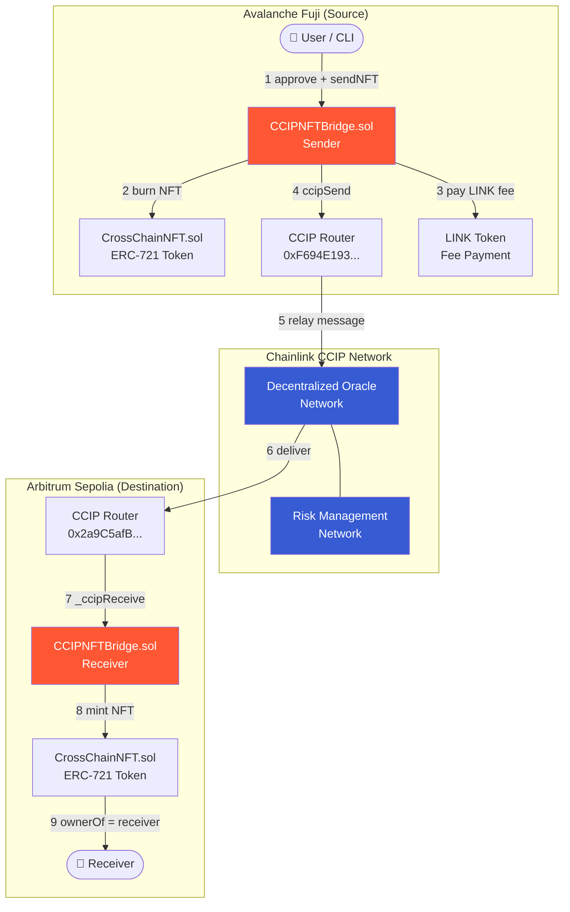
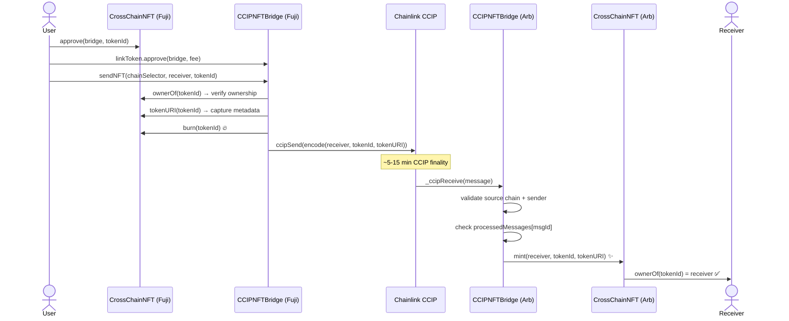
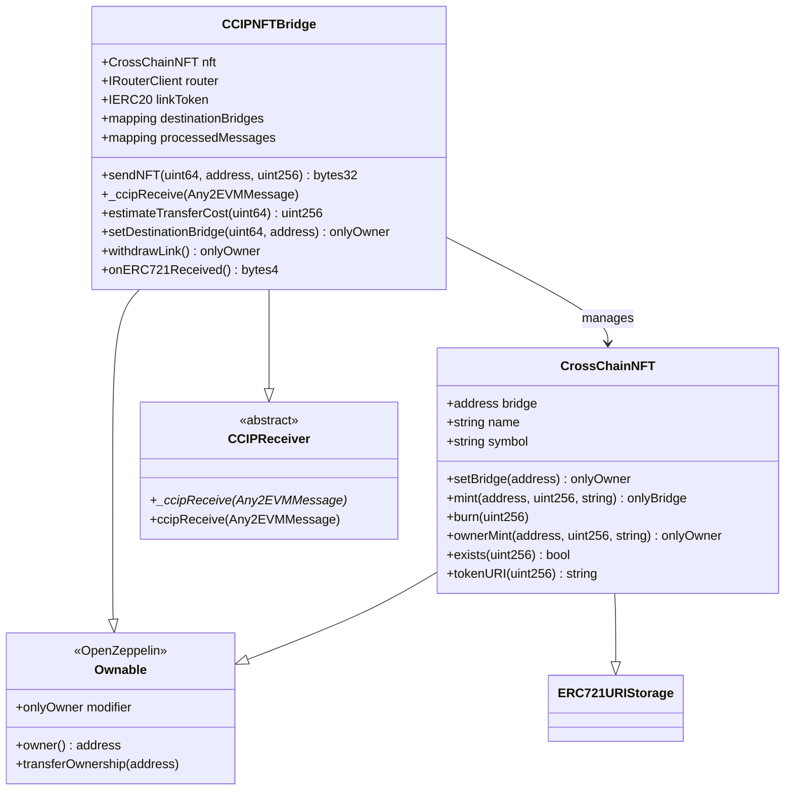
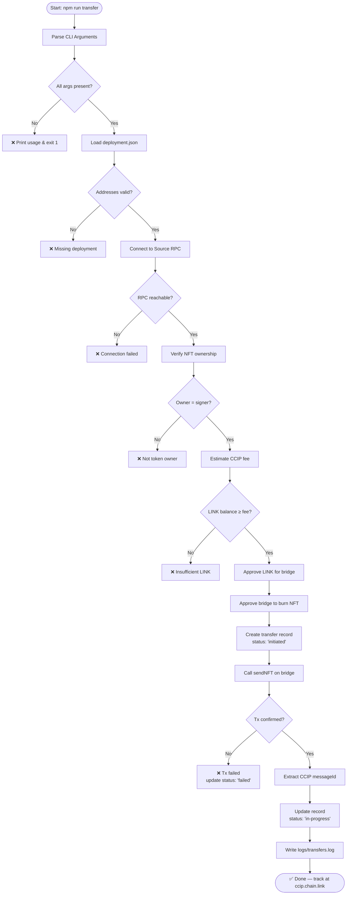

<div align="center">

# 🌉 InterChain NFT Bridge

### *Production-Ready Cross-Chain NFT Transfer with Metadata Preservation*

<br/>

[](https://soliditylang.org)
[](https://nodejs.org)
[](https://getfoundry.sh)
[](https://docs.chain.link/ccip)
[](https://docker.com)
[](https://github.com)
[](LICENSE)

<br/>

> **Burn on source. Mint on destination. Zero duplicates.**  
> Bridge ERC-721 NFTs across blockchains with full metadata preservation, powered by Chainlink CCIP.

<br/>

[📋 Overview](#-overview) • [🏗️ Architecture](#️-architecture) • [🛠️ Tech Stack](#️-tech-stack) • [📁 Structure](#-folder-structure) • [🚀 Quick Start](#-quick-start) • [💻 CLI Usage](#-cli-usage) • [🧪 Testing](#-testing) • [🔐 Security](#-security)

</div>

---

## 📋 Overview

The **InterChain NFT Bridge** enables secure, trustless transfer of ERC-721 NFTs between **Avalanche Fuji** and **Arbitrum Sepolia** testnets using Chainlink's Cross-Chain Interoperability Protocol (CCIP).

Instead of locking NFTs in a vault (which creates wrapped duplicates), this bridge uses a **burn-and-mint** pattern:

| Step | Chain | Action |
|------|-------|--------|
| 1️⃣ | **Avalanche Fuji** | NFT is permanently **burned** — `tokenId` + `tokenURI` encoded into CCIP message |
| 2️⃣ | **CCIP Network** | Chainlink's DON securely relays the message cross-chain |
| 3️⃣ | **Arbitrum Sepolia** | Identical NFT **minted** to receiver with same `tokenId` + `tokenURI` |

> **Key Guarantee:** Total NFT supply is constant across all chains — no duplicates, ever.

---

## 🏗️ Architecture

### High-Level System Overview



### Burn-and-Mint Flow



### Contract Interaction Map



---

## 🛠️ Tech Stack

| Layer | Technology | Version | Purpose |
|-------|-----------|---------|---------|
| **Smart Contracts** | Solidity | `^0.8.20` | ERC-721 + CCIP bridge logic |
| **Cross-Chain** | Chainlink CCIP | Latest | Secure cross-chain messaging |
| **Token Standard** | OpenZeppelin ERC-721 + URIStorage | `v4.9.0` | NFT with on-chain metadata |
| **Access Control** | OpenZeppelin Ownable | `v4.9.0` | Role-based administration |
| **Dev Toolchain** | Foundry | `v1.6.0` | Compile, test, deploy |
| **CLI** | Node.js + ethers.js | `18+` / `v6` | Transaction submission & logging |
| **ID Generation** | uuid | `v9` | Unique transfer UUIDs |
| **Env Management** | dotenv | `v16` | Secure env variable loading |
| **Containerization** | Docker + Compose | Latest | Reproducible CLI environment |
| **Source Chain** | Avalanche Fuji Testnet | — | NFT burn (source) |
| **Destination Chain** | Arbitrum Sepolia Testnet | — | NFT mint (destination) |

---

## 📁 Folder Structure

```
InterChainNFT-Bridge/
│
├── 📁 src/                          # Solidity smart contracts
│   ├── CrossChainNFT.sol            # ERC-721 with bridge-controlled minting
│   └── CCIPNFTBridge.sol            # CCIP send/receive bridge logic
│
├── 📁 test/                         # Foundry unit tests (38 tests)
│   ├── CrossChainNFT.t.sol          # 19 tests: mint, burn, access control
│   └── CCIPNFTBridge.t.sol          # 19 tests: send, receive, mock router
│
├── 📁 script/                       # Foundry deployment scripts
│   └── Deploy.s.sol                 # DeployFuji | DeployArbitrumSepolia | Configure
│
├── 📁 cli/                          # Node.js CLI entrypoint
│   ├── transfer.js                  # Main CLI — argument parsing, tx submission, logging
│   ├── CrossChainNFT.abi.json       # NFT contract ABI (loaded at runtime)
│   └── CCIPNFTBridge.abi.json       # Bridge contract ABI (loaded at runtime)
│
├── 📁 data/
│   └── nft_transfers.json           # Structured transfer records (UUID schema)
│
├── 📁 logs/
│   └── transfers.log                # Timestamped operational log file
│
├── foundry.toml                     # Foundry config + remappings
├── deployment.json                  # Deployed contract addresses (both chains)
├── package.json                     # Node.js deps + npm scripts
├── Dockerfile                       # Node 18 Alpine image
├── docker-compose.yml               # CLI service orchestration
├── .env.example                     # Environment variable template
└── README.md                        # This file
```

---

## 🚀 Quick Start

### Prerequisites

| Tool | Version | Install |
|------|---------|---------|
| **Foundry** | Latest | `curl -L https://foundry.paradigm.xyz \| bash && foundryup` |
| **Node.js** | 18+ | [nodejs.org](https://nodejs.org) |
| **Docker** | Latest | [docker.com](https://docker.com) |
| **Git** | Latest | [git-scm.com](https://git-scm.com) |

### Step 1 — Clone & Install

```bash
git clone https://github.com/ramalokeshreddyp/InterChainNFT-Bridge.git
cd InterChainNFT-Bridge

# Install Foundry Solidity libraries
forge install OpenZeppelin/openzeppelin-contracts@v4.9.0 --no-commit
forge install smartcontractkit/chainlink-brownie-contracts@0.8.0 --no-commit
forge install foundry-rs/forge-std --no-commit

# Install Node.js dependencies
npm install
```

### Step 2 — Configure Environment

```bash
cp .env.example .env
```

Fill in `.env`:

```env
# Wallet (without 0x prefix)
PRIVATE_KEY=your_64_char_private_key_here

# RPC URLs
FUJI_RPC_URL=https://api.avax-test.network/ext/bc/C/rpc
ARBITRUM_SEPOLIA_RPC_URL=https://sepolia-rollup.arbitrum.io/rpc

# Chainlink CCIP — Avalanche Fuji
CCIP_ROUTER_FUJI=0xF694E193200268f9a4868e4Aa017A0118C9a8177
LINK_TOKEN_FUJI=0x0b9d5D9136855f6FEc3c0993feE6E9CE8a297846

# Chainlink CCIP — Arbitrum Sepolia
CCIP_ROUTER_ARBITRUM_SEPOLIA=0x2a9C5afB0d0e4BAb2BCdaE109EC4b0c4Be15a165
LINK_TOKEN_ARBITRUM_SEPOLIA=0xb1D4538B4571d411F07960EF2838Ce337FE1E80E
```

### Step 3 — Compile Contracts

```bash
forge build
# Expected: Compiler run successful!
```

### Step 4 — Run Tests

```bash
forge test -vv
# Expected: 38 tests passed, 0 failed
```

### Step 5 — Deploy Contracts

```bash
# Deploy to Avalanche Fuji (pre-mints tokenId=1 to deployer)
forge script script/Deploy.s.sol:DeployFuji \
  --rpc-url $FUJI_RPC_URL --broadcast --verify -vvvv

# Deploy to Arbitrum Sepolia
forge script script/Deploy.s.sol:DeployArbitrumSepolia \
  --rpc-url $ARBITRUM_SEPOLIA_RPC_URL --broadcast --verify -vvvv
```

### Step 6 — Update `deployment.json`

```json
{
  "avalancheFuji": {
    "nftContractAddress": "0x<YOUR_FUJI_NFT>",
    "bridgeContractAddress": "0x<YOUR_FUJI_BRIDGE>"
  },
  "arbitrumSepolia": {
    "nftContractAddress": "0x<YOUR_ARB_NFT>",
    "bridgeContractAddress": "0x<YOUR_ARB_BRIDGE>"
  }
}
```

### Step 7 — Configure Cross-Chain Trust

```bash
# Set env vars first: FUJI_BRIDGE_ADDRESS, ARBITRUM_SEPOLIA_BRIDGE_ADDRESS
forge script script/Deploy.s.sol:Configure --rpc-url $FUJI_RPC_URL --broadcast -vvvv
forge script script/Deploy.s.sol:Configure --rpc-url $ARBITRUM_SEPOLIA_RPC_URL --broadcast -vvvv
```

### Step 8 — Fund with LINK

Get LINK tokens from [faucets.chain.link](https://faucets.chain.link) on both networks (~2 LINK each).

---

## 💻 CLI Usage

### Via Docker (Recommended)

```bash
# Start container
docker compose up -d --build

# Run transfer
docker exec ccip-nft-bridge-cli npm run transfer -- \
  --tokenId=1 \
  --from=avalanche-fuji \
  --to=arbitrum-sepolia \
  --receiver=0xYOUR_WALLET_ADDRESS

# View logs
docker exec ccip-nft-bridge-cli cat logs/transfers.log

# View transfer records
docker exec ccip-nft-bridge-cli cat data/nft_transfers.json
```

### Native (Node.js)

```bash
npm run transfer -- \
  --tokenId=1 \
  --from=avalanche-fuji \
  --to=arbitrum-sepolia \
  --receiver=0xYOUR_WALLET_ADDRESS
```

### CLI Arguments

| Argument | Type | Required | Example |
|----------|------|----------|---------|
| `--tokenId` | integer | ✅ | `--tokenId=1` |
| `--from` | chain name | ✅ | `--from=avalanche-fuji` |
| `--to` | chain name | ✅ | `--to=arbitrum-sepolia` |
| `--receiver` | address | ✅ | `--receiver=0x1234...` |

### CLI Execution Flow



### Expected Output

```
✨ ══════════════════════════════════════
   Cross-chain transfer initiated!
   ══════════════════════════════════════
   Transfer ID:    550e8400-e29b-41d4-a716-...
   Token ID:       1
   From:           avalanche-fuji
   To:             arbitrum-sepolia
   Receiver:       0xYOUR_ADDRESS
   Source Tx:      0xabc123...
   CCIP Msg ID:    0xdef456...

   🔍 Track progress:
   https://ccip.chain.link/msg/0xdef456...

   ⏱  CCIP typically finalizes in 5–15 minutes.
   📊 Record saved to: data/nft_transfers.json
   📝 Logs written to: logs/transfers.log
```

---

## 🧪 Testing

### Run All Tests

```bash
forge test -vv
```

### Test Results (38/38 Passing)

```
Ran 19 tests for test/CrossChainNFT.t.sol
[PASS] test_setBridge_success        [PASS] test_setBridge_onlyOwner
[PASS] test_setBridge_emitsEvent     [PASS] test_setBridge_rejectsZeroAddress
[PASS] test_mint_success             [PASS] test_mint_onlyBridge
[PASS] test_mint_rejectsDuplicate    [PASS] test_mint_emitsEvent
[PASS] test_ownerMint_success        [PASS] test_ownerMint_onlyOwner
[PASS] test_burn_byOwner             [PASS] test_burn_byApprovedOperator
[PASS] test_burn_byApprovedForAll    [PASS] test_burn_revertsUnauthorized
[PASS] test_exists_returnsTrue       [PASS] test_exists_returnsFalse
[PASS] test_supportsERC721           [PASS] test_supportsERC721Metadata
[PASS] test_nameAndSymbol
Suite result: ok. 19 passed; 0 failed ✅

Ran 19 tests for test/CCIPNFTBridge.t.sol
[PASS] test_sendNFT_burnsNFT              [PASS] test_sendNFT_returnsCCIPMessageId
[PASS] test_sendNFT_revertsNotOwner       [PASS] test_sendNFT_revertsUnsupportedChain
[PASS] test_sendNFT_revertsZeroReceiver   [PASS] test_sendNFT_emitsNFTSentEvent
[PASS] test_ccipReceive_mintsNFTToReceiver
[PASS] test_ccipReceive_idempotent_skipsMintIfExists
[PASS] test_ccipReceive_rejectsReplayedMessageId
[PASS] test_ccipReceive_rejectsUnauthorizedSender
[PASS] test_ccipReceive_rejectsUnknownSourceChain
[PASS] test_ccipReceive_emitsNFTReceivedEvent
[PASS] test_estimateTransferCost_returnsMockFee
[PASS] test_constructor_setsState
[PASS] test_setDestinationBridge_onlyOwner [PASS] test_setDestinationBridge_rejectsZero
[PASS] test_withdrawLink_onlyOwner         [PASS] test_withdrawLink_success
[PASS] test_onERC721Received_returnsSelector
Suite result: ok. 19 passed; 0 failed ✅
```

### Gas Report

```bash
forge test --gas-report
```

---

## � Pre-Minted Test NFT

| Property | Value |
|----------|-------|
| **Chain** | Avalanche Fuji |
| **Token ID** | `1` |
| **Owner** | Deployer wallet (`PRIVATE_KEY`) |
| **tokenURI** | `ipfs://bafkreiabc123testcrosschainnftmetadatatokenid1` |

To transfer this NFT:
```bash
npm run transfer -- --tokenId=1 --from=avalanche-fuji --to=arbitrum-sepolia --receiver=0xYOUR_ADDRESS
```

---

## 📡 Transfer Record Schema

```json
{
  "transferId": "550e8400-e29b-41d4-a716-446655440000",
  "tokenId": "1",
  "sourceChain": "avalanche-fuji",
  "destinationChain": "arbitrum-sepolia",
  "sender": "0xSenderAddress",
  "receiver": "0xReceiverAddress",
  "ccipMessageId": "0xCCIPMessageId",
  "sourceTxHash": "0xSourceTxHash",
  "destinationTxHash": null,
  "status": "in-progress",
  "metadata": {
    "name": "CrossChain NFT #1",
    "description": "A cross-chain NFT",
    "image": "ipfs://..."
  },
  "timestamp": "2026-02-27T09:10:00.000Z"
}
```

---

## � Security

| Threat | Mitigation | Test Coverage |
|--------|-----------|---------------|
| Unauthorized minting | `onlyBridge` modifier on `mint()` | `test_mint_onlyBridge` ✅ |
| Fake CCIP messages | Validates `sourceChainSelector` + `sender` in `_ccipReceive` | `test_ccipReceive_rejectsUnauthorized*` ✅ |
| Message replay | `processedMessages[messageId]` mapping | `test_ccipReceive_rejectsReplayedMessageId` ✅ |
| Double-mint | `nft.exists(tokenId)` check before mint | `test_ccipReceive_idempotent_*` ✅ |
| Wrong chain target | `destinationBridges` mapping required | `test_sendNFT_revertsUnsupportedChain` ✅ |
| Re-entrancy | Checks-Effects-Interactions pattern | State written before external calls ✅ |
| Unauthorized admin | `Ownable` pattern on all admin functions | `test_*_onlyOwner` ✅ |

---

## 🌐 Chain Configuration

| Chain | CCIP Selector | CCIP Router | LINK Token |
|-------|--------------|-------------|-----------|
| **Avalanche Fuji** | `14767482510784806043` | `0xF694E193...` | `0x0b9d5D91...` |
| **Arbitrum Sepolia** | `3478487238524512106` | `0x2a9C5afB...` | `0xb1D4538B...` |

---

## 🔍 Monitoring & Tracking

| Tool | URL |
|------|-----|
| **CCIP Explorer** | [ccip.chain.link](https://ccip.chain.link) |
| **Snowtrace (Fuji)** | [testnet.snowtrace.io](https://testnet.snowtrace.io) |
| **Arbiscan (Sepolia)** | [sepolia.arbiscan.io](https://sepolia.arbiscan.io) |
| **LINK Faucet** | [faucets.chain.link](https://faucets.chain.link) |

---

## 📜 License

MIT © 2026 — Built with ❤️ using [Chainlink CCIP](https://chain.link/cross-chain) + [Foundry](https://getfoundry.sh)

<div align="center">

**[⬆ Back to Top](#-interchain-nft-bridge)**

</div>
