# 🏛️ Architecture — InterChain NFT Bridge

> **Chainlink CCIP Cross-Chain NFT Transfer System**  
> Detailed system architecture, design decisions, and component interactions.

---

## Table of Contents

1. [System Overview](#1-system-overview)
2. [Core Design Pattern: Burn-and-Mint](#2-core-design-pattern-burn-and-mint)
3. [Smart Contract Architecture](#3-smart-contract-architecture)
4. [CCIP Message Lifecycle](#4-ccip-message-lifecycle)
5. [Security Architecture](#5-security-architecture)
6. [CLI Architecture](#6-cli-architecture)
7. [Deployment Topology](#7-deployment-topology)
8. [Data Flow Diagrams](#8-data-flow-diagrams)
9. [State Machine](#9-state-machine)
10. [Network Configuration](#10-network-configuration)

---

## 1. System Overview

The InterChain NFT Bridge is a **two-contract + one-CLI** system that bridges ERC-721 NFTs between L1/L2 chains using Chainlink CCIP as the messaging layer.

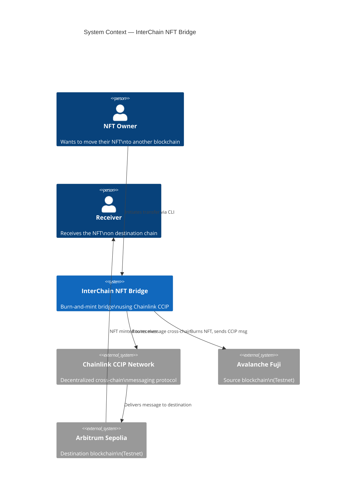

### Architectural Principles

| Principle | Implementation |
|-----------|---------------|
| **Separation of Concerns** | `CrossChainNFT` = token logic; `CCIPNFTBridge` = messaging logic |
| **Least Privilege** | Bridge can only mint; owner can only configure; users can only burn their own NFTs |
| **Idempotency** | `exists(tokenId)` prevents double-minting even if message replayed |
| **Fail-Safe** | All state changes before external calls (Checks-Effects-Interactions) |
| **Auditability** | Every action emits an indexed event; CLI writes structured logs |

---

## 2. Core Design Pattern: Burn-and-Mint

### Why Burn-and-Mint over Lock-and-Wrap?

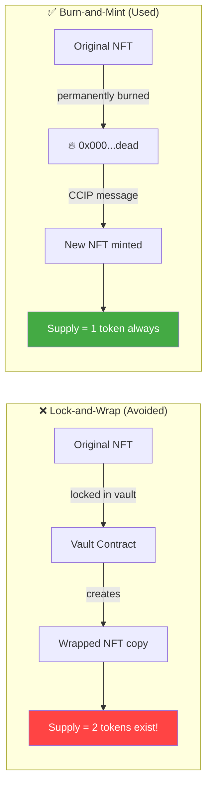

**Advantages of Burn-and-Mint:**
- ✅ Constant supply across all chains — no inflation
- ✅ No vault management risk
- ✅ Simpler mental model for users
- ✅ Identical `tokenId` and `tokenURI` on both chains
- ✅ No wrapped-token fragmentation

---

## 3. Smart Contract Architecture

### 3.1 CrossChainNFT.sol

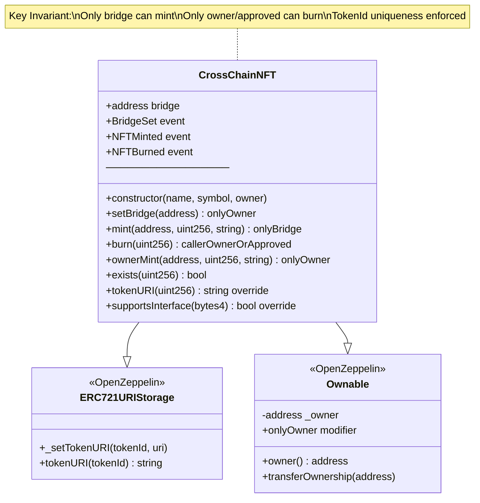

**Access Control Matrix — CrossChainNFT:**

| Function | Owner | Bridge | Token Holder | Anyone |
|----------|-------|--------|-------------|--------|
| `setBridge` | ✅ | ❌ | ❌ | ❌ |
| `mint` | ❌ | ✅ | ❌ | ❌ |
| `ownerMint` | ✅ | ❌ | ❌ | ❌ |
| `burn` | ❌ | ❌ | ✅ | ❌ |
| `tokenURI` | ✅ | ✅ | ✅ | ✅ |

### 3.2 CCIPNFTBridge.sol

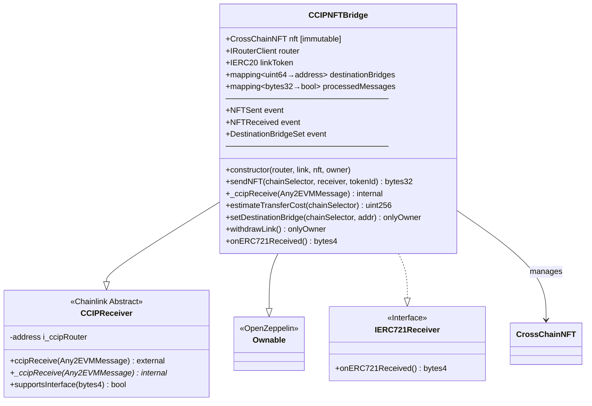

---

## 4. CCIP Message Lifecycle

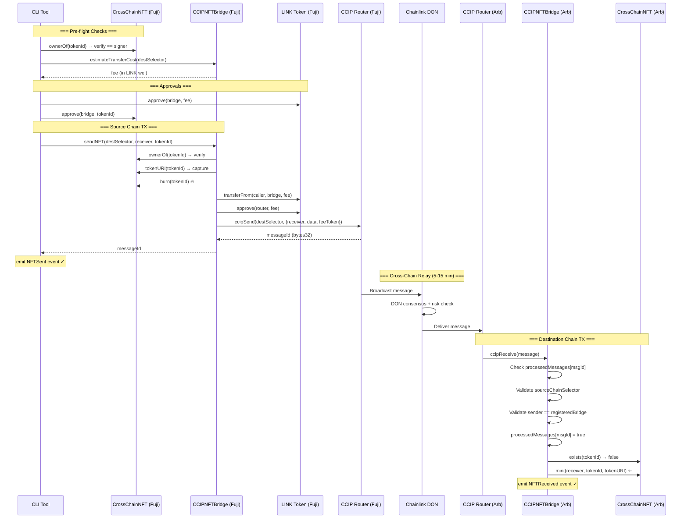

### CCIP Message Payload Structure

```mermaid
graph TD
    subgraph "EVM2AnyMessage (Source → CCIP Router)"
        R[receiver: abi.encode(destBridgeAddress)]
        D[data: abi.encode(receiverAddr, tokenId, tokenURI)]
        TA[tokenAmounts: empty array]
        EA[extraArgs: gasLimit=300_000]
        FT[feeToken: LINK address]
    end

    subgraph "Any2EVMMessage (CCIP Router → _ccipReceive)"
        MI[messageId: bytes32]
        SC[sourceChainSelector: uint64]
        SE[sender: abi.encode(srcBridgeAddress)]
        DA[data: abi.encode(receiver, tokenId, tokenURI)]
    end
```

---

## 5. Security Architecture

### 5.1 Threat Model and Mitigations

```mermaid
mindmap
    root((Security))
        Access Control
            onlyBridge on mint
            onlyOwner on admin
            Owner-or-approved on burn
        Message Validation
            Source chain whitelist
            Sender address matching
            processedMessages replay guard
        Asset Safety
            Burn before send
            Idempotent mint
            exists() check
        Code Safety
            CEI pattern
            Immutable router ref
            No delegatecall
        Operational
            withdrawLink escape hatch
            Events for auditability
            Indexed events for filtering
```

### 5.2 Attack Vectors & Defenses

| Attack Vector | Risk | Defense |
|--------------|------|---------|
| Unauthorized mint | Attacker calls `mint()` directly | `onlyBridge` modifier — only `CCIPNFTBridge` address can call |
| Forged CCIP message | Attacker sends fake message to `_ccipReceive` | Only CCIP Router (`i_ccipRouter`) can call `ccipReceive` |
| Wrong source chain | Message from attacker-controlled chain | `destinationBridges[sourceChainSelector]` must be set |
| Impersonating bridge | Attacker deploys fake bridge | `abi.decode(message.sender)` must match registered bridge address |
| Message replay | Re-deliver same CCIP message | `processedMessages[messageId] = true` before mint |
| Double-mint | Token already exists on dest chain | `nft.exists(tokenId)` check — skip mint if already present |
| Re-entrancy | Malicious NFT contract callbacks | State updated **before** external calls (CEI) |
| Admin takeover | Attacker calls `setDestinationBridge` | `Ownable.onlyOwner` restricts to deployer |

### 5.3 Trust Boundary Diagram

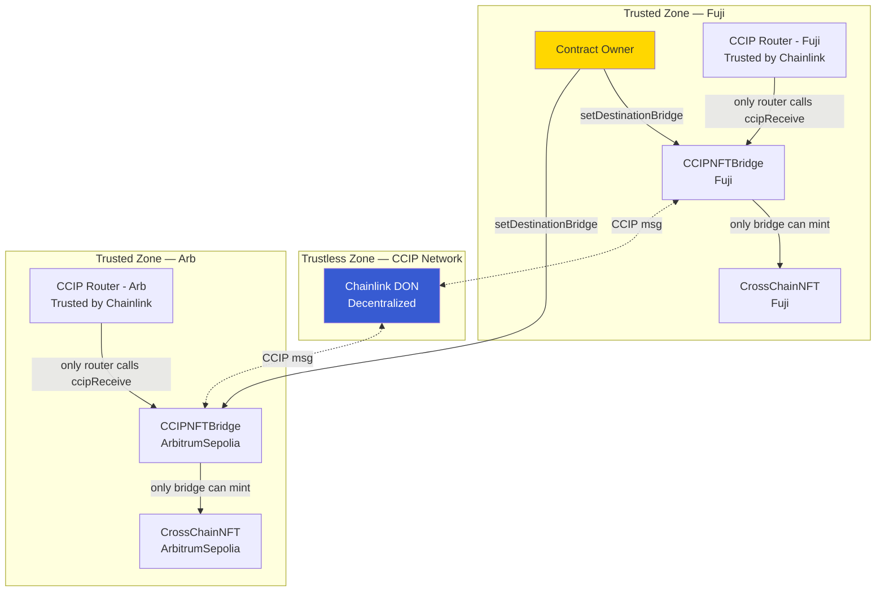

---

## 6. CLI Architecture

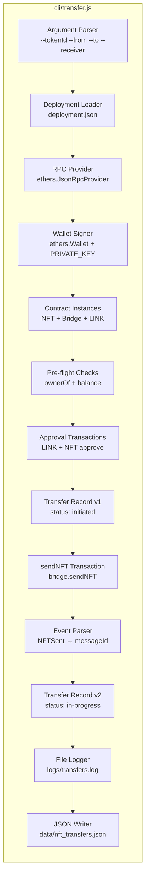

### CLI Module Responsibilities

| Module | Responsibility |
|--------|---------------|
| **Argument Parser** | Parse `--flag=value` and `--flag value` syntax; validate chain names and address format |
| **Deployment Loader** | Read `deployment.json`; validate contract addresses exist on-chain |
| **RPC Provider** | Create `ethers.JsonRpcProvider`; verify connectivity via `getBlockNumber()` |
| **Contract Instances** | Instantiate `CrossChainNFT`, `CCIPNFTBridge`, LINK ERC-20 with ABIs from `cli/*.abi.json` |
| **Pre-flight Checks** | Verify NFT ownership, LINK balance, and source contract bytecode |
| **Approval Manager** | Check existing allowances; skip if sufficient; submit approve tx if needed |
| **Transfer Executor** | Call `sendNFT`; wait for confirmation; extract CCIP `messageId` from event logs |
| **Record Manager** | Create UUID-tagged record; upsert into `data/nft_transfers.json` |
| **File Logger** | Timestamped append-only log to `logs/transfers.log` with level prefixes |

---

## 7. Deployment Topology

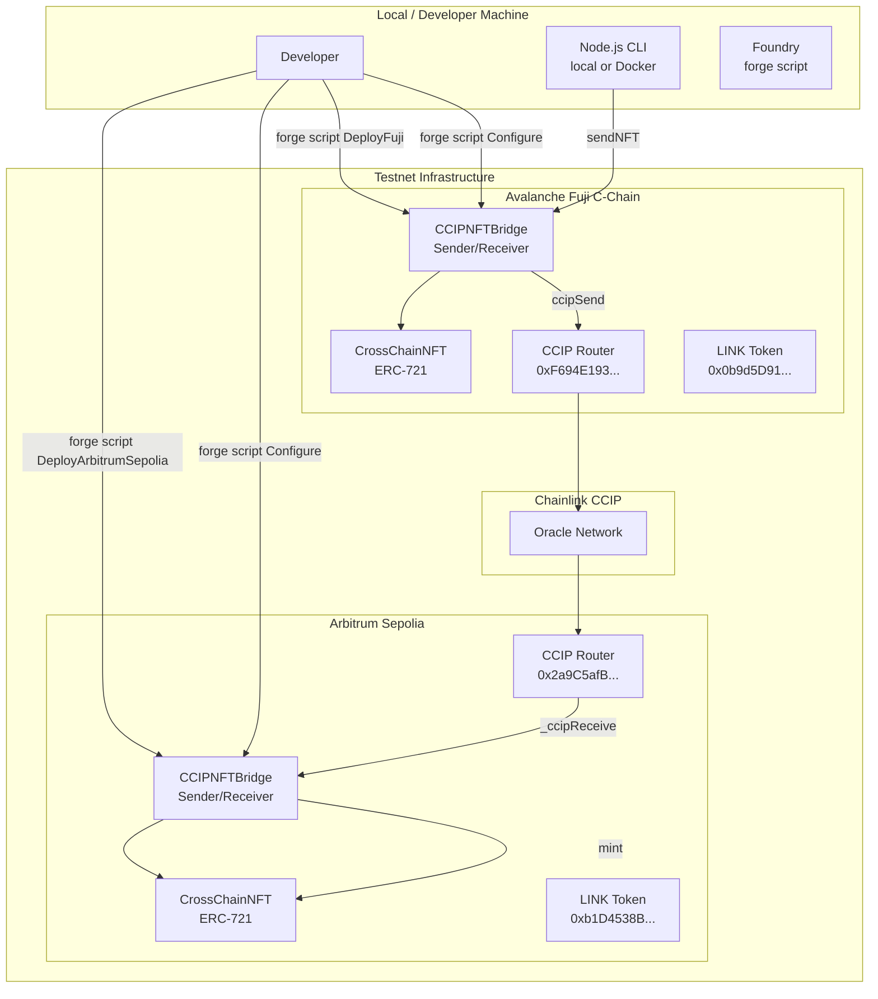

### Deployment Sequence

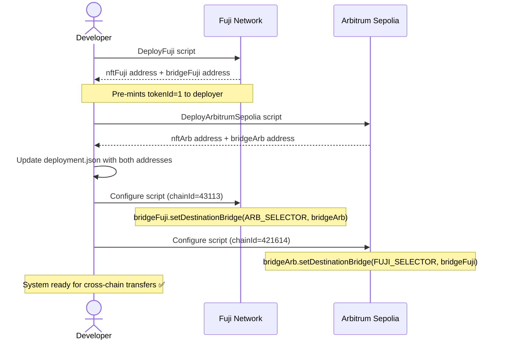

---

## 8. Data Flow Diagrams

### 8.1 Token Metadata Preservation

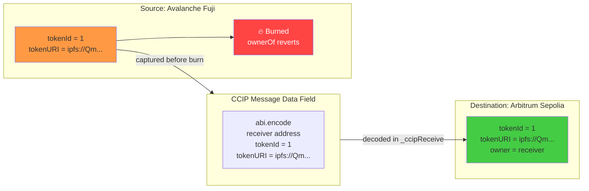

### 8.2 Fee Flow

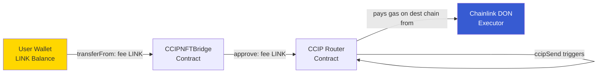

---

## 9. State Machine

### NFT Transfer State Machine

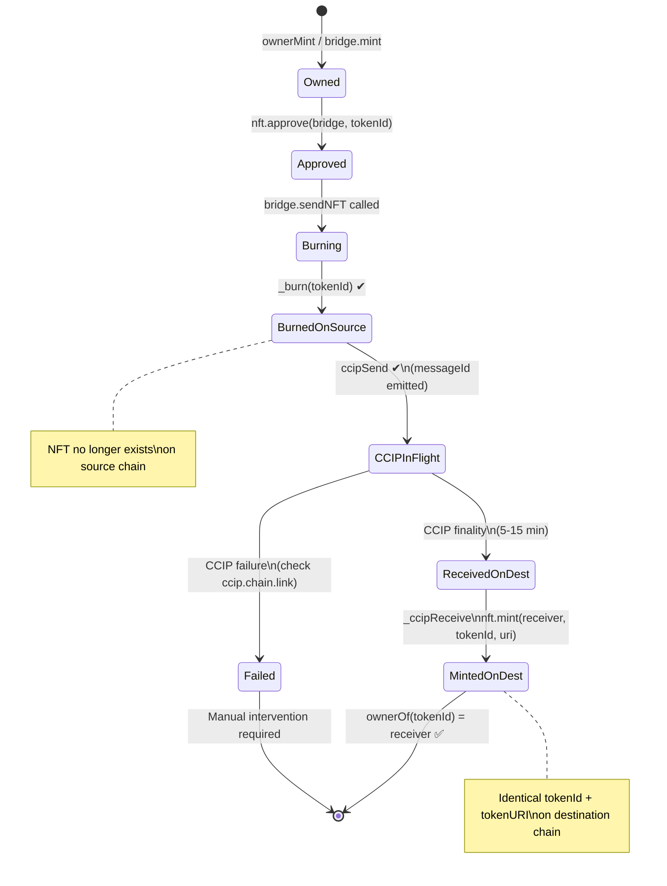

### CLI Transfer Record Status Machine

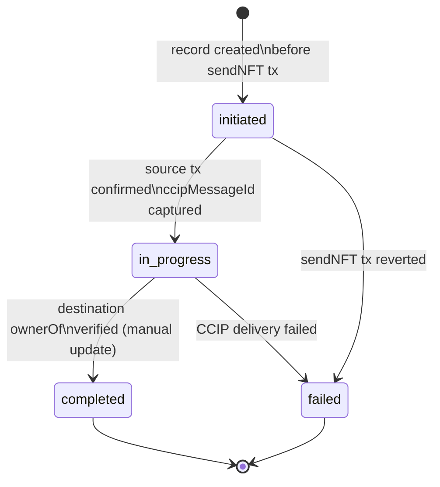

---

## 10. Network Configuration

### Supported Networks

| Parameter | Avalanche Fuji | Arbitrum Sepolia |
|-----------|---------------|-----------------|
| **Chain ID** | `43113` | `421614` |
| **CCIP Selector** | `14767482510784806043` | `3478487238524512106` |
| **CCIP Router** | `0xF694E193200268f9a4868e4Aa017A0118C9a8177` | `0x2a9C5afB0d0e4BAb2BCdaE109EC4b0c4Be15a165` |
| **LINK Token** | `0x0b9d5D9136855f6FEc3c0993feE6E9CE8a297846` | `0xb1D4538B4571d411F07960EF2838Ce337FE1E80E` |
| **RPC (public)** | `https://api.avax-test.network/ext/bc/C/rpc` | `https://sepolia-rollup.arbitrum.io/rpc` |
| **Explorer** | [testnet.snowtrace.io](https://testnet.snowtrace.io) | [sepolia.arbiscan.io](https://sepolia.arbiscan.io) |
| **Native Token** | AVAX | ETH |
| **Role in Bridge** | Source + Destination | Source + Destination |

---

*Architecture document for InterChain NFT Bridge v1.0.0 — Built with Chainlink CCIP + Foundry*
