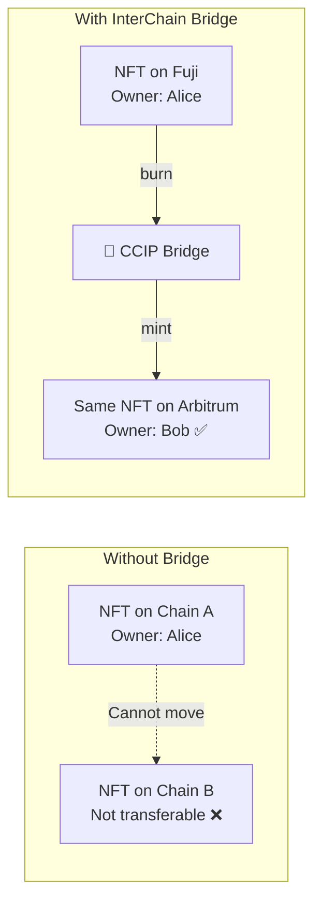
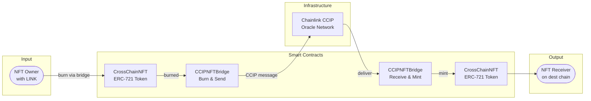
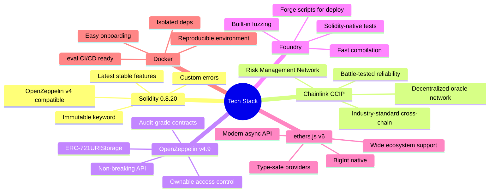
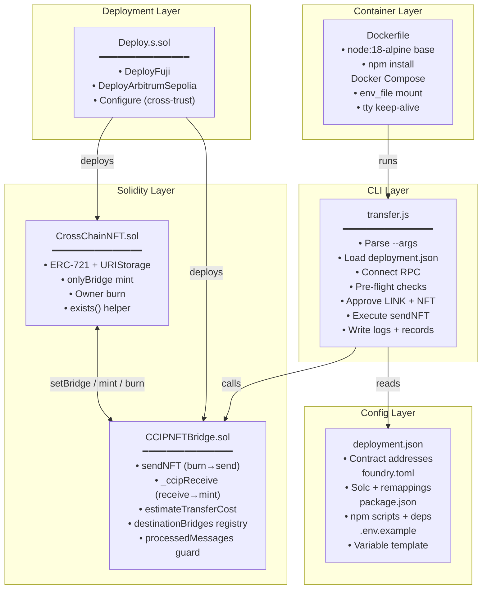
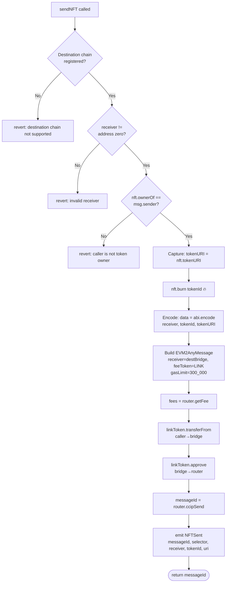
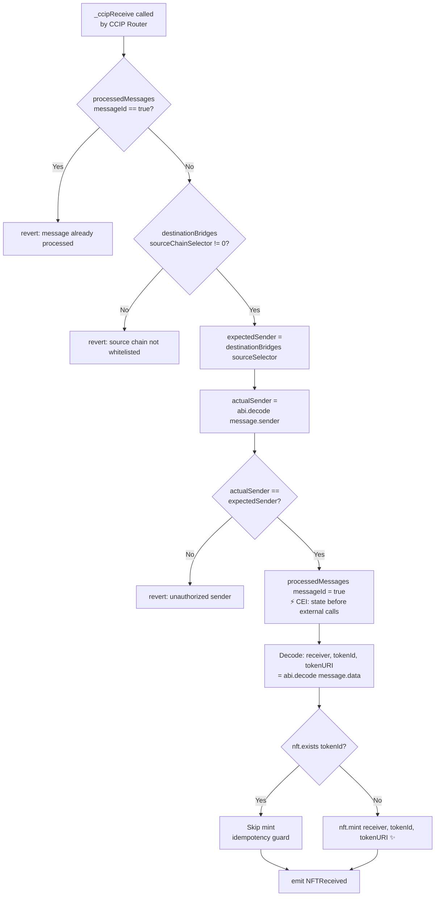
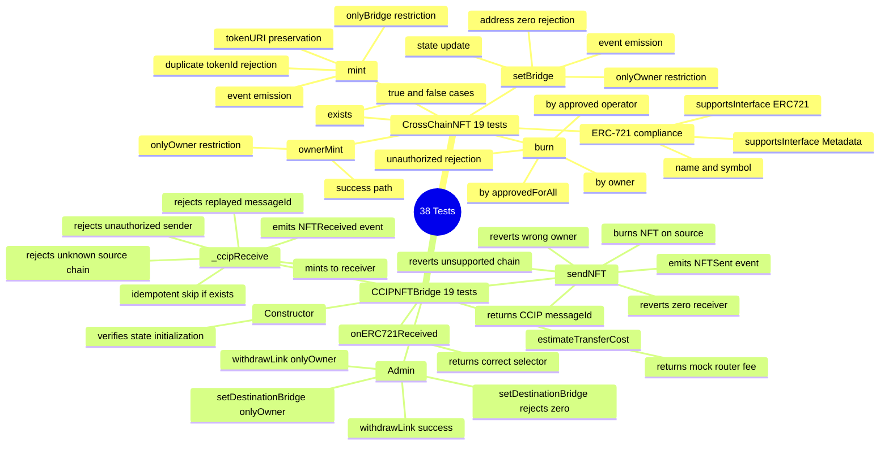
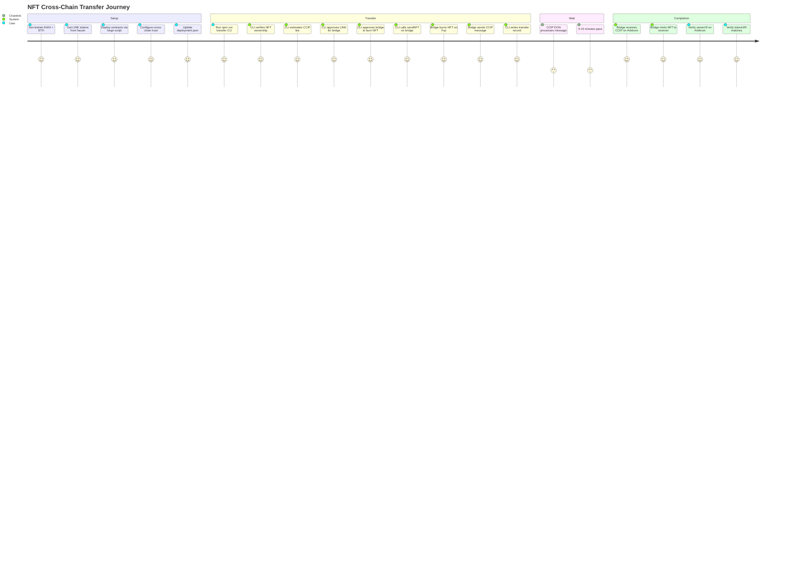
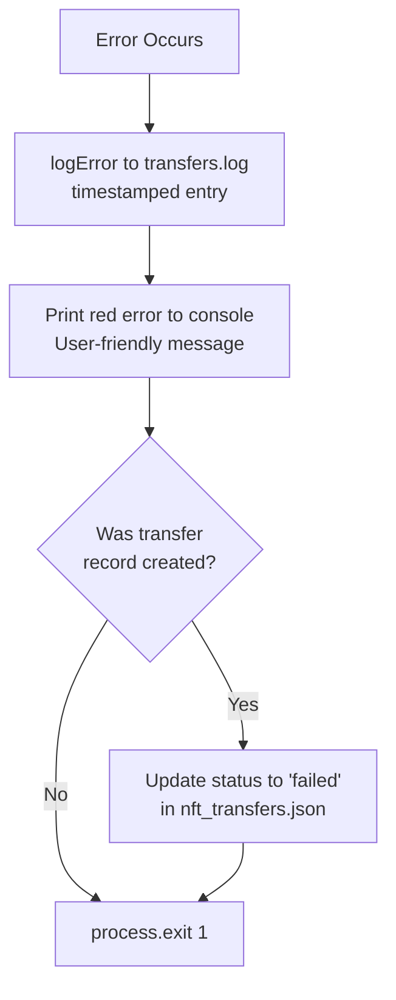

# 📚 Project Documentation — InterChain NFT Bridge

> **Chainlink CCIP Cross-Chain NFT Transfer with Metadata Preservation**  
> Complete technical documentation covering design, implementation, testing, and operations.

---

## Table of Contents

1. [Project Objective](#1-project-objective)
2. [Problem Statement](#2-problem-statement)
3. [Solution Overview](#3-solution-overview)
4. [Tech Stack & Rationale](#4-tech-stack--rationale)
5. [Key Modules & Responsibilities](#5-key-modules--responsibilities)
6. [Implementation Deep Dive](#6-implementation-deep-dive)
7. [Testing Strategy](#7-testing-strategy)
8. [Security Model](#8-security-model)
9. [Docker & Containerization](#9-docker--containerization)
10. [Pros, Cons & Trade-offs](#10-pros-cons--trade-offs)
11. [Execution Flow — End to End](#11-execution-flow--end-to-end)
12. [Environment & Configuration](#12-environment--configuration)
13. [Error Handling Strategy](#13-error-handling-strategy)
14. [Monitoring & Debugging](#14-monitoring--debugging)
15. [Future Improvements](#15-future-improvements)

---

## 1. Project Objective

The **InterChain NFT Bridge** is a production-ready cross-chain solution that enables users to transfer ERC-721 NFTs between **Avalanche Fuji** and **Arbitrum Sepolia** testnets while preserving complete metadata — including `tokenId` and `tokenURI` — on the destination chain.

### Goals

| Goal | Achievement |
|------|-------------|
| Zero duplicate tokens | ✅ Burn-and-mint pattern ensures constant supply |
| Metadata preservation | ✅ `tokenURI` encoded in CCIP payload and decoded on receipt |
| Security-first design | ✅ Multi-layer access control, replay protection, CEI pattern |
| CLI-driven workflow | ✅ `npm run transfer` with structured logging and JSON records |
| Containerization | ✅ Docker Compose for reproducible execution |
| Comprehensive testing | ✅ 38 Foundry unit tests, 0 failures |

---

## 2. Problem Statement

### The Multi-Chain NFT Silo Problem



**Challenges Solved:**
- NFTs are siloed on their native chain
- Moving assets typically creates wrapped copies (supply inflation)
- Metadata must be preserved exactly — same `tokenId`, same `tokenURI`
- Cross-chain communication needs a secure, reliable oracle network

---

## 3. Solution Overview

### System at a Glance



### Core Mechanism: Burn-and-Mint

The bridge uses an atomic cross-chain operation:
1. **Source chain** → NFT burned (`_burn(tokenId)`) — token no longer exists
2. **CCIP payload** → `abi.encode(receiver, tokenId, tokenURI)` sent
3. **Destination chain** → NFT minted (`_safeMint(receiver, tokenId)`) — identical token created

**Supply invariant**: At any time, exactly 1 copy of any given `tokenId` exists across all chains.

---

## 4. Tech Stack & Rationale

### Why These Technologies?



| Technology | Version | Why Chosen |
|-----------|---------|------------|
| **Solidity** | `^0.8.20` | Latest stable; custom errors, immutable, sane overflow |
| **Chainlink CCIP** | Latest | Only production-grade cross-chain messaging with RMN |
| **OpenZeppelin** | `v4.9.0` | Audited ERC-721, URIStorage, Ownable — v4 API stable |
| **Foundry** | `v1.6.0` | Solidity-native tests, fast builds, forge script deploys |
| **ethers.js** | `v6.x` | Modern BigInt API; works seamlessly with Foundry ABIs |
| **Node.js** | `18 LTS` | Long-term support; native fetch; compatible with ethers v6 |
| **Docker Compose** | v3.8 | Simple orchestration; env_file support; volume mounts |
| **uuid v9** | `v9` | Cryptographically strong UUIDs for transfer record IDs |
| **dotenv v16** | `v16` | Standard env loading; works in Docker via env_file |

---

## 5. Key Modules & Responsibilities

### Module Map



### 5.1 CrossChainNFT.sol — Responsibilities

| Function | Who Calls | What It Does |
|----------|----------|-------------|
| `constructor(name, symbol, owner)` | Deployment script | Sets ERC-721 name/symbol, sets owner |
| `setBridge(address)` | Owner (script/admin) | Authorizes the bridge to mint |
| `mint(address, uint256, string)` | Bridge only | Mints NFT with tokenURI on destination |
| `ownerMint(address, uint256, string)` | Owner | Pre-mint test NFTs during deployment |
| `burn(uint256)` | Token holder / approved | Burns NFT before cross-chain send |
| `exists(uint256)` | Bridge (_ccipReceive) | Idempotency check before mint |
| `tokenURI(uint256)` | Bridge (sendNFT) | Capture URI before burn |

### 5.2 CCIPNFTBridge.sol — Responsibilities

| Function | Who Calls | What It Does |
|----------|----------|-------------|
| `sendNFT(selector, receiver, tokenId)` | User / CLI | Burns NFT, encodes payload, sends CCIP |
| `_ccipReceive(message)` | CCIP Router only | Validates, decodes, mints NFT |
| `estimateTransferCost(selector)` | CLI / UI | Returns LINK fee estimate |
| `setDestinationBridge(selector, addr)` | Owner | Registers trusted bridge on remote chain |
| `withdrawLink()` | Owner | Emergency LINK recovery |
| `onERC721Received()` | ERC-721 sender | Implements IERC721Receiver |

---

## 6. Implementation Deep Dive

### 6.1 sendNFT — Step by Step



### 6.2 _ccipReceive — Step by Step



### 6.3 CCIP Message Encoding

```solidity
// Payload encoded by sendNFT:
bytes memory data = abi.encode(receiver, tokenId, tokenURI_);

// Message structure:
Client.EVM2AnyMessage memory ccipMessage = Client.EVM2AnyMessage({
    receiver: abi.encode(destinationBridges[destinationChainSelector]),
    data: data,
    tokenAmounts: new Client.EVMTokenAmount[](0), // no token transfers, only message
    extraArgs: Client._argsToBytes(
        Client.EVMExtraArgsV1({gasLimit: 300_000})
    ),
    feeToken: address(linkToken)  // pay in LINK
});
```

### 6.4 Gas Optimization Decisions

| Decision | Rationale |
|----------|-----------|
| `immutable nft` | Saves SLOAD on every call — set once in constructor |
| `mapping(bytes32 → bool)` for processed msgs | O(1) replay check, minimal storage |
| Capture `tokenURI` before burn | ERC-721URIStorage clears URI on `_burn` — must capture first |
| `gasLimit: 300_000` in extraArgs | Sufficient for mint + storage write on destination |
| Skip approval if allowance sufficient | Reduces unnecessary transactions and gas waste |

---

## 7. Testing Strategy

### Test Coverage Map



### Mock Contracts Used in Tests

```solidity
// MockCCIPRouter — simulates Chainlink CCIP Router
contract MockCCIPRouter {
    bytes32 constant MOCK_MESSAGE_ID = keccak256("mock-ccip-message");
    uint256 constant MOCK_FEE = 0.1 ether;

    function getFee(uint64, Client.EVM2AnyMessage memory)
        external pure returns (uint256) { return MOCK_FEE; }

    function ccipSend(uint64, Client.EVM2AnyMessage memory)
        external pure returns (bytes32) { return MOCK_MESSAGE_ID; }
}

// MockLinkToken — simulates ERC-20 LINK token
contract MockLinkToken {
    // Standard ERC-20 with mint helper for test setup
}

// BridgeHarness — exposes internal _ccipReceive for direct testing
contract BridgeHarness is CCIPNFTBridge {
    function exposed_ccipReceive(Client.Any2EVMMessage memory message) external {
        _ccipReceive(message);
    }
}
```

### Test Execution

```bash
# Run all tests
forge test -vv

# Run specific contract tests
forge test --match-contract CrossChainNFTTest -vv
forge test --match-contract CCIPNFTBridgeTest -vv

# Run specific test
forge test --match-test test_sendNFT_burnsNFT -vvvv

# Gas report
forge test --gas-report

# Coverage
forge coverage
```

---

## 8. Security Model

### Defense in Depth

```mermaid
flowchart TB
    subgraph "Layer 1 — Network Level"
        L1A[Chainlink CCIP Router\nOnly entry point for cross-chain msgs]
        L1B[Risk Management Network\nMonitors for anomalies]
    end

    subgraph "Layer 2 — Contract Level"
        L2A[CCIPReceiver base class\nOnly router can call ccipReceive]
        L2B[destinationBridges mapping\nWhitelist of trusted remote bridges]
        L2C[sender validation\nabi.decode and compare]
    end

    subgraph "Layer 3 — Message Level"
        L3A[processedMessages mapping\nReplay protection per messageId]
        L3B[sourceChainSelector check\nMust be whitelisted]
    end

    subgraph "Layer 4 — Token Level"
        L4A[onlyBridge modifier\nOnly bridge can mint]
        L4B[exists() check\nIdempotent mint]
        L4C[ownerOf check in sendNFT\nOnly owner can initiate burn]
    end

    L1A --> L2A
    L1B --> L2A
    L2A --> L2B
    L2B --> L2C
    L2C --> L3A
    L3A --> L3B
    L3B --> L4A
    L4A --> L4B
    L4B --> L4C
```

### Invariants

| Invariant | Enforcement |
|-----------|-------------|
| Exactly 1 copy of any tokenId across all chains | Burn before send; idempotent mint |
| Only CCIP Router can trigger minting | `CCIPReceiver.ccipReceive` → `onlyRouter` modifier |
| Only authorized bridges can trigger minting | `destinationBridges` registry + sender validation |
| No message processed twice | `processedMessages[messageId]` boolean flag |
| Only token owner/approved can burn | Explicit check: `ownerOf == msg.sender OR isApprovedForAll OR getApproved` |
| Bridge address is immutable once deployed | `immutable nft` — set in constructor |

---

## 9. Docker & Containerization

### Container Architecture

```mermaid
graph TB
    subgraph "Docker Compose Stack"
        subgraph "cli service"
            IMG[node:18-alpine base image]
            APP[/usr/src/app\nApplication Root]
            NM[node_modules\nInstalled deps]
            CMD[CMD: tail -f /dev/null\nKeep container running]
        end
    end

    subgraph "Host Volume Mount"
        HOST[./  Host project root]
        LOGS_H[logs/transfers.log]
        DATA_H[data/nft_transfers.json]
    end

    subgraph ".env Configuration"
        ENV[env_file: .env\nPrivate key + RPC URLs]
    end

    HOST -->|volume: .:/usr/src/app| APP
    ENV -->|injected into container| APP
    APP -->|writes logs| LOGS_H
    APP -->|writes records| DATA_H
```

### Volume Mount Benefits

- **Real-time log visibility** — `logs/transfers.log` written in container is immediately readable on host
- **Persistent records** — `data/nft_transfers.json` survives container restarts
- **Live code updates** — Changes to `cli/transfer.js` on host apply immediately without rebuild

### Docker Commands Reference

```bash
# Build and start
docker compose up -d --build

# Execute transfer
docker exec ccip-nft-bridge-cli npm run transfer -- \
  --tokenId=1 --from=avalanche-fuji --to=arbitrum-sepolia \
  --receiver=0xYOUR_ADDRESS

# Read logs
docker exec ccip-nft-bridge-cli cat logs/transfers.log

# Read transfer records
docker exec ccip-nft-bridge-cli cat data/nft_transfers.json

# Interactive shell
docker exec -it ccip-nft-bridge-cli sh

# Stop container
docker compose down
```

---

## 10. Pros, Cons & Trade-offs

### ✅ Advantages

| Advantage | Detail |
|-----------|--------|
| **No token duplication** | Burn-and-mint guarantees 1 token across all chains |
| **Full metadata preservation** | `tokenId` + `tokenURI` passed in CCIP payload |
| **Security-first** | Chainlink RMN + 4-layer access control |
| **Idempotent design** | Safe to re-deliver CCIP messages without side effects |
| **Transparent logging** | Every step logged with timestamp; structured JSON record |
| **Containerized** | One-command setup with Docker; reproducible environment |
| **38 unit tests** | High confidence in correctness of all edge cases |
| **Gas efficient** | Immutable refs, O(1) mappings, minimal storage writes |

### ⚠️ Trade-offs

| Trade-off | Reason | Mitigation |
|-----------|--------|------------|
| Burn is irreversible | NFT destroyed on source before CCIP confirm | CCIP is highly reliable; use CCIP Explorer to track |
| 5–15 min latency | CCIP finality across chains takes time | Expected for cross-chain; track via ccip.chain.link |
| LINK required as fee | CCIP router charges LINK for message relay | `estimateTransferCost` helps users pre-approve exact amount |
| Single direction tested | Fuji → Arbitrum is primary flow | Both bridges deployed symmetrically; reverse transfer possible |
| No escrow fallback | If CCIP fails, burn already happened | CCIP has 99.9%+ delivery rate; failure is very rare |

### Comparison: Lock-and-Wrap vs Burn-and-Mint

| Property | Lock-and-Wrap | **Burn-and-Mint (Ours)** |
|----------|--------------|--------------------------|
| Supply consistency | ❌ Wrapped copies exist | ✅ Exactly 1 copy always |
| Gas on source | Medium (lock tx) | Medium (burn tx) |
| Vault risk | ❌ Vault hack = funds lost | ✅ No vault |
| Metadata fidelity | ⚠️ Depends on wrapper | ✅ Exact same tokenId + URI |
| Complexity | High (lock + wrap + redeem) | Medium (burn + mint) |

---

## 11. Execution Flow — End to End



### Complete CLI Execution Timeline

```mermaid
gantt
    title CLI Transfer Execution Timeline
    dateFormat SSS
    axisFormat %Lms

    section Startup
    Parse arguments          :a1, 000, 50ms
    Load deployment.json     :a2, after a1, 10ms

    section Network
    Connect to Fuji RPC      :b1, after a2, 500ms
    Verify contract bytecode :b2, after b1, 200ms

    section Pre-flight
    Check NFT ownership      :c1, after b2, 200ms
    Estimate CCIP fee        :c2, after c1, 200ms
    Check LINK balance       :c3, after c2, 100ms

    section Approvals
    Approve LINK (if needed) :d1, after c3, 3000ms
    Approve NFT (if needed)  :d2, after d1, 3000ms

    section Transfer
    Create transfer record   :e1, after d2, 50ms
    Submit sendNFT tx        :e2, after e1, 5000ms
    Wait for confirmation    :e3, after e2, 10000ms
    Extract CCIP messageId   :e4, after e3, 50ms

    section Finalization
    Update transfer record   :f1, after e4, 50ms
    Write to transfers.log   :f2, after f1, 10ms
    Print success output     :f3, after f2, 10ms
```



---

## 12. Environment & Configuration

### Required Environment Variables

| Variable | Description | Example |
|----------|-------------|---------|
| `PRIVATE_KEY` | 64-char hex private key (no 0x) | `ac0974bec...` |
| `FUJI_RPC_URL` | Avalanche Fuji JSON-RPC endpoint | `https://api.avax-test.network/...` |
| `ARBITRUM_SEPOLIA_RPC_URL` | Arbitrum Sepolia JSON-RPC endpoint | `https://sepolia-rollup.arbitrum.io/rpc` |
| `CCIP_ROUTER_FUJI` | CCIP Router address on Fuji | `0xF694E193...` |
| `CCIP_ROUTER_ARBITRUM_SEPOLIA` | CCIP Router address on Arb Sepolia | `0x2a9C5afB...` |
| `LINK_TOKEN_FUJI` | LINK token address on Fuji | `0x0b9d5D91...` |
| `LINK_TOKEN_ARBITRUM_SEPOLIA` | LINK token address on Arb Sepolia | `0xb1D4538B...` |
| `FUJI_BRIDGE_ADDRESS` | Deployed bridge on Fuji (post-deploy) | `0x...` |
| `ARBITRUM_SEPOLIA_BRIDGE_ADDRESS` | Deployed bridge on Arb (post-deploy) | `0x...` |

### Deployment Configuration (`deployment.json`)

```json
{
  "avalancheFuji": {
    "nftContractAddress": "0x<CrossChainNFT on Fuji>",
    "bridgeContractAddress": "0x<CCIPNFTBridge on Fuji>"
  },
  "arbitrumSepolia": {
    "nftContractAddress": "0x<CrossChainNFT on Arbitrum>",
    "bridgeContractAddress": "0x<CCIPNFTBridge on Arbitrum>"
  }
}
```

### Foundry Configuration (`foundry.toml`)

```toml
[profile.default]
src = "src"
out = "out"
libs = ["lib"]
test = "test"
script = "script"
optimizer = true
optimizer_runs = 200
solc_version = "0.8.24"

remappings = [
    "@openzeppelin/contracts/=lib/openzeppelin-contracts/contracts/",
    "@chainlink/contracts-ccip/=lib/chainlink-ccip/contracts/",
    "forge-std/=lib/forge-std/src/",
]
```

---

## 13. Error Handling Strategy

### CLI Error Catalogue

| Error | Cause | Message |
|-------|-------|---------|
| Missing arguments | Required `--flag` not provided | `Missing required arguments: tokenId, from, to, receiver` |
| Unknown chain | Invalid chain name | `Unknown source chain: "xyz". Valid: avalanche-fuji, arbitrum-sepolia` |
| Invalid address | Malformed Ethereum address | `Invalid receiver address: "0xinvalid"` |
| Zero address | `0x000...000` as receiver | `Receiver cannot be zero address` |
| No deployment.json | File missing | `deployment.json not found — please deploy contracts first` |
| No contract code | Address has no bytecode | `Source NFT address has no deployed contract code` |
| Bad private key | Wrong format | `PRIVATE_KEY format is invalid. Expected 64 hex chars` |
| RPC unreachable | Network error | `Failed to connect to RPC endpoint` |
| Token not owned | Signer ≠ owner | `Token #1 is owned by 0x..., not by signer 0x...` |
| LINK insufficient | Balance < fee | `Not enough LINK. Have X, need Y` |
| Tx reverted | On-chain revert | `Transaction failed: <revert reason>` |

### Error Flow



---

## 14. Monitoring & Debugging

### Track a Cross-Chain Transfer

```bash
# 1. Get CCIP Message ID from logs
grep "CCIP message ID" logs/transfers.log

# 2. Check CCIP Explorer
open https://ccip.chain.link/msg/<MESSAGE_ID>

# 3. Check Fuji NFT burned
cast call <FUJI_NFT_ADDRESS> "ownerOf(uint256)(address)" 1 \
  --rpc-url $FUJI_RPC_URL
# Should revert (ERC721: invalid token ID) if burned

# 4. Check Arbitrum NFT minted
cast call <ARB_NFT_ADDRESS> "ownerOf(uint256)(address)" 1 \
  --rpc-url $ARBITRUM_SEPOLIA_RPC_URL
# Should return receiver address
```

### Log File Format

```
[2026-02-27T09:10:00.000Z] [INFO]  === CCIP NFT Bridge CLI Started ===
[2026-02-27T09:10:00.001Z] [INFO]  Transfer parameters parsed | {"tokenId":"1","from":"avalanche-fuji",...}
[2026-02-27T09:10:01.500Z] [INFO]  Connected to network | {"chain":"avalanche-fuji"}
[2026-02-27T09:10:01.510Z] [INFO]  Signer ready | {"address":"0x..."}
[2026-02-27T09:10:02.000Z] [INFO]  NFT ownership verified | {"tokenId":"1","tokenURI":"ipfs://..."}
[2026-02-27T09:10:02.100Z] [INFO]  CCIP fee estimated | {"fee":"0.1 LINK"}
[2026-02-27T09:10:05.000Z] [INFO]  LINK approved | {"txHash":"0x..."}
[2026-02-27T09:10:08.000Z] [INFO]  NFT approved for bridge burn | {"txHash":"0x..."}
[2026-02-27T09:10:08.010Z] [INFO]  Transfer record created | {"transferId":"uuid","status":"initiated"}
[2026-02-27T09:10:08.020Z] [INFO]  Submitting sendNFT transaction
[2026-02-27T09:10:13.000Z] [INFO]  Transaction confirmed | {"txHash":"0x...","blockNumber":"12345"}
[2026-02-27T09:10:13.010Z] [INFO]  CCIP message ID captured | {"ccipMessageId":"0x..."}
[2026-02-27T09:10:13.020Z] [INFO]  Transfer record updated | {"status":"in-progress"}
[2026-02-27T09:10:13.030Z] [INFO]  === Transfer initiated successfully ===
```

---

## 15. Future Improvements

```mermaid
roadmap
    title InterChain NFT Bridge — Roadmap
    section v1.0 Current
        Fuji to Arb Sepolia bridge    : done, 2026-02
        Burn-and-mint pattern         : done, 2026-02
        CLI with logging + records    : done, 2026-02
        38 unit tests                 : done, 2026-02
        Docker containerization       : done, 2026-02
    section v1.1 Near-term
        Mainnet deployment            : 2026-Q2
        Multi-chain support           : 2026-Q2
        Reverse direction Arb to Fuji : 2026-Q2
        Web UI for transfers          : 2026-Q2
    section v2.0 Long-term
        ERC-1155 batch transfers      : 2026-Q3
        Transfer status polling daemon: 2026-Q3
        Webhook notifications         : 2026-Q3
        Gas abstraction (paymaster)   : 2026-Q4
```

### Potential Enhancements

| Enhancement | Description | Benefit |
|-------------|-------------|---------|
| **Mainnet deployment** | Deploy to Avalanche C-Chain + Arbitrum One | Real-asset bridging |
| **Multi-chain support** | Add Ethereum, Optimism, Polygon via CCIP selectors | Broader reach |
| **ERC-1155 support** | Extend for multi-token transfers | Gaming/DeFi use cases |
| **Web UI** | React frontend for non-CLI users | Mass adoption |
| **Status daemon** | Background poller that completes `destinationTxHash` | Full record lifecycle |
| **Gas token support** | Pay CCIP fees in native tokens via wrapped ETH/AVAX | LINK-free UX |
| **Events indexer** | Subgraph for on-chain event history | Analytics dashboard |
| **Permit2 integration** | Gasless approval for LINK and NFT | Better UX |

---

*Project Documentation for InterChain NFT Bridge v1.0.0*  
*Built February 2026 — Chainlink CCIP + Foundry + Node.js 18*
